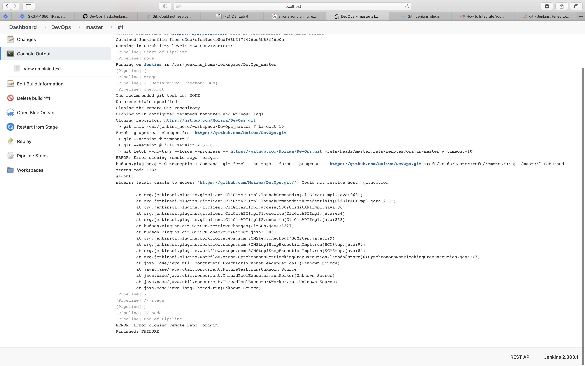
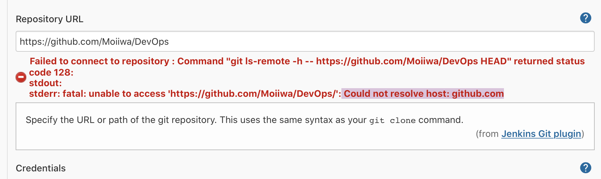

#CI best practices
##Github actions best practices
###Caching
 * Advantages:  
 1) Space saving
 2) Time saving
 * Disadvantages:  
 1) Caches can not be updated in github actions, so we need to cache files that will not be changed. For example static images or templates, as
 I've done here, since my templates and images won't change.  
 Also I have cached dependencies, since they are the same all the time.
###Docker layers caching
In order to speed up pipeline I decided to use the next Github Actions library  
```
https://github.com/marketplace/actions/docker-layer-caching
```
With the use of it we can save time and (potentially) space.  
In order to use it installation is needed, but it takes about 13 seconds, meanwhile docker build may take much more time without it, in my case it was 23 seconds.

Also in order to avoid errors during this stage I set up action the way that it  
will ignore this stage in case of failure and will simply build an image.

###Jobs separation
I separated jobs into three instead of one big job. They will work sequentially,
since I have specified that "test" job depend on "build" one and "deploy" depends on
"test". Thus if one stage fails, others will not run.

###Github secrets
In order to save credentials, I have used github secrets, which store dockerhub login and password
in an encrypted form.

##Jenkins part

###Why nothing worked
Firstly I went through instructions from the lab descriptions and installed  
jenkins several times with and without plugins, no matter how, it gave me the next error after adding repository https url:

After almost giving up googling I have decided to try with instructions with Google, they
suggested to use the first option in item creation and not multibranch pipline, after
walking through the whole instructions I've got the same error, but in the other form.

Repository was public, so I have no idea why this really happened.
