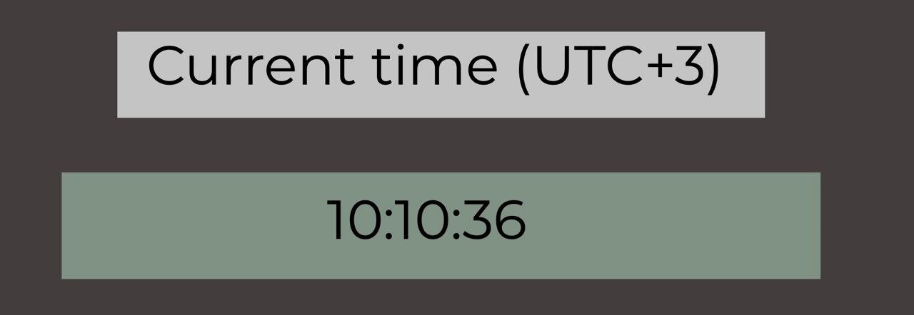

  <h3 align="center">**Moscow time displayer**</h3>

<!-- TABLE OF CONTENTS -->
<details open="open">
  <summary>Table of Contents</summary>
  <ol>
    <li>
      <a href="#about-the-project">About The Project</a>
      <ul>
        <li><a href="#built-with">Built With</a></li>
      </ul>
    </li>
    <li>
      <a href="#getting-started">Getting Started</a>
      <ul>
        <li><a href="#prerequisites">Prerequisites</a></li>
        <li><a href="#installation">Installation</a></li>
      </ul>
    </li>
    <li><a href="#usage">Usage</a></li>
    <li><a href="#license">License</a></li>
    <li><a href="#contact">Contact</a></li>
  </ol>
</details>

 

<!-- ABOUT THE PROJECT -->
## About The Project


This is a simple Django application that returns html template with Moscow time which is being updated each second.  
You can see example below.
  
Also you can check the full version of the site by the next [link](http://moi-wa.com)

### Built With
* Django
* Javascript


<!-- GETTING STARTED -->
## Getting Started


### Prerequisites

#### CMD
In order to run server without docker you should use the next commands from the
root directory of the project.

* 
  ```sh
  pip install --no-cache-dir -r requirements.txt
  ```
#### Docker  
If you want to run project with Docker, first of all you need to get it installed

  ```sh
  sudo apt-get docker.io
  ```
### Installation

1. Clone the repo
   ```sh
   git clone https://github.com/Moiiwa/DevOps.git
   ```
2. Go to the app_python folder
   ```sh
   cd app_python
   ```
3. * Docker-less approach
    ```sh 
    python manage.py runserver 0.0.0.0:8000
   ```
   * Docker approach
    1. ```sh
       sudo docker build -t <your tag> .
        ```
    2. ```sh
        sudo docker run -p 8000:8000 <your tag>   
        ```
      


<!-- USAGE EXAMPLES -->
## Usage

All you need is just to go to http://0.0.0.0:8000/  

###Upd: 27.09.21
New feature added, after going to http://0.0.0.0:8000/visits
user may see the time of last visit to http://0.0.0.0:8000/ .


<!-- LICENSE -->
## License
Distributed under imaginary license by Mikhail Gudkov (2021).


<!-- CONTACT -->
## Contact

Mikhail Gudkov - telegram: @moiiwa
