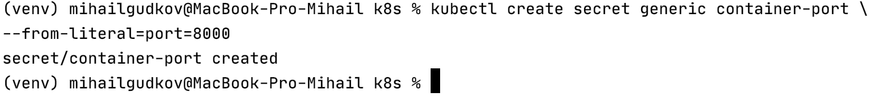
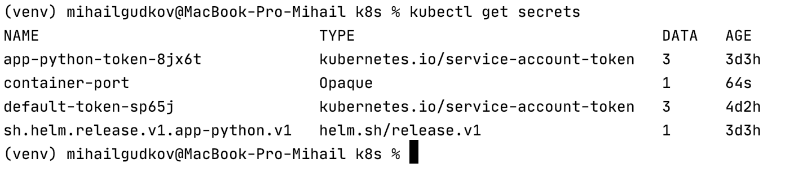
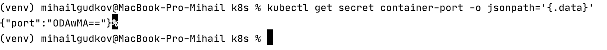
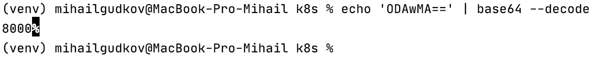
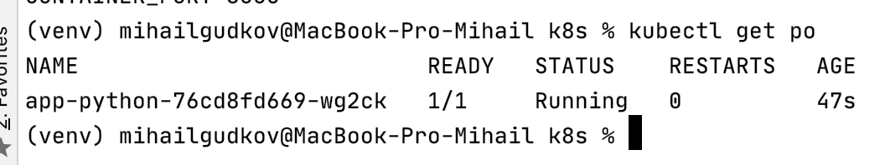
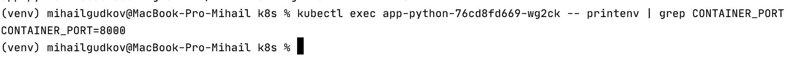

#Secrets best practices

##Secret creation 

##Secret verification

##Secret decoding pt.1

##Secret decoding pt.2

##Helm secrets

After adding a secret and updating deployment check pod

And for this pod get environment variable, that stores the secret

