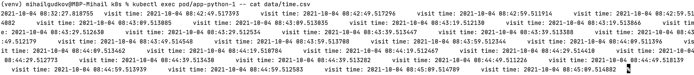

##StatefulSet

###Output for pods
Pod 0:

Pod 1:

Pod 2:

###Description of output

As I understood, each time we access page different pod responds in order to 
balance load, that's why the time for all the three pods is different.

###Importance of ordering
If we won't guarantee ordering for our app, the first pod will always response until it falls due to the high
load or overfill of storage, that's why it is important to make different pods respond
instead of loading only one.