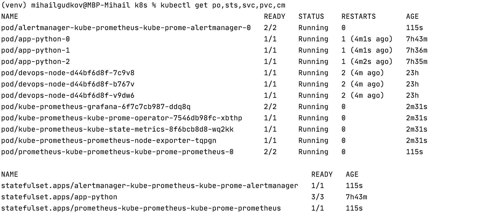

#Components description
The Prometheus Operator:
Installation and configuration of prometheus in k8s.  

Highly available Prometheus: Prometheus itself.

Highly available Alertmanager: tool for handling alerts from client such as promtheus.

Prometheus node-exporter: collector of OS and hardware-related metrics.

Prometheus Adapter for Kubernetes Metrics APIs: metrics collector that may replace default metrics server.

kube-state-metrics: state-of-objects metrics collector.

Grafana - grafana itself, UI
#Output of kubectl get po,sts,svc,pvc,cm 

Part 1: pods and stateful sets

Part 2: services and persistent volume claims

Part 3: configmaps

#Dashboards
1)StatefulSet resources consumption:

2a)Most CPU-consuming pods 

2b)Least CPU-consuming pods

3)Memory usage

As you can see 69.1 percent or 1.83 GiB is used.

4)Pods number

As you can see there are a lot of them, it is a little bit more than should be, because i have
some pods running from labs before and also trash i tried to use, when grafana didn't want to run before i used port-forward,
some of them are absent on screenshots cause I added them later.

5)Network usage

As you can see, prometheus is top-1 in consumption

And the least consuming are my trash-pods from previous labs and grafana, the next are my current app pods.

6)Alerts

As you can see, I have 7 alerts

#Part with init container (Not so good)
This part confused me, cause I configured everything, as I hope correctly, but pods refused to start, here's what i got.

After describing a pod i've got this 

Which showed that there are problems with pulling an image, I've already
met this problem before, and full reboot of minikube had helped then, but not now. Due to this issue, i wasn't able
to finish this part of the lab.
