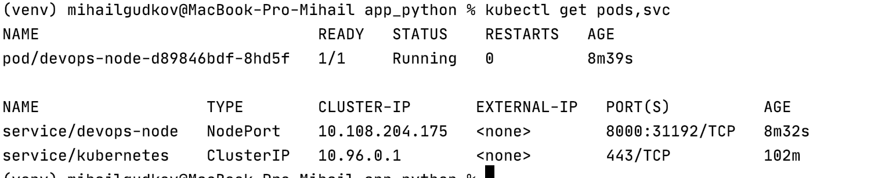
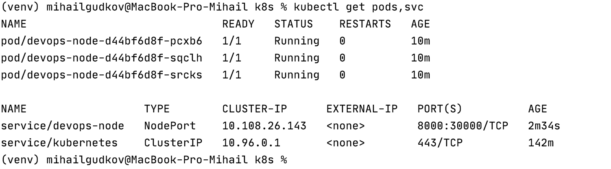
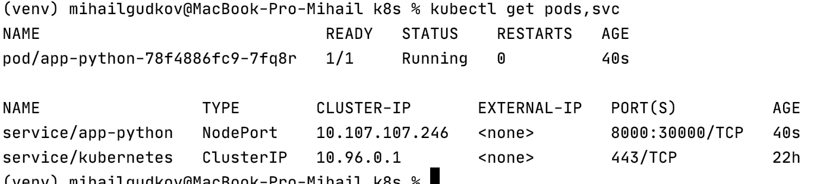
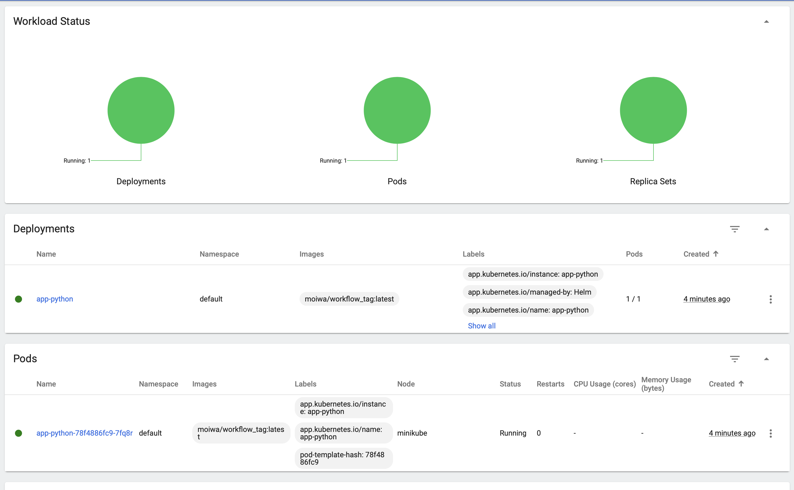
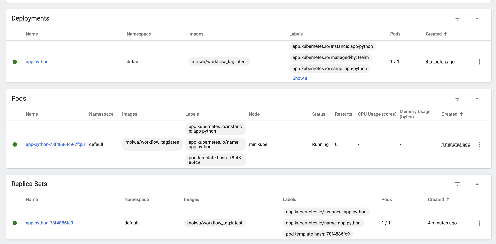

#Kubernetes 
####Done by Mikhail Gudkov
To install kubectl and minikube use this link
```
https://kubernetes.io/docs/tasks/tools/
```
##Manual deployment
First of all you need to start minikube
```
 minikube start --vm-driver=hyperkit 
```
You can use another driver, but minikube itself recommends to use exactly
hyperkit.

To create deployment use the next command
```
kubectl create deployment devops-node --image=<tag_name> 
```
In my case it looks like
```
kubectl create deployment devops-node --image=moiwa/workflow_tag 
```

Now we need to create service in order to get access to our container from beyond
.
```
kubectl expose deployment/devops-node --type="NodePort" --port 8000
```
Now we need to

```
export NODE_PORT=$(kubectl get services/devops-node -o go-template='{{(index .spec.ports 0).nodePort}}')
echo NODE_PORT=$NODE_PORT
```
To check that everything is ok you can either use 
```
curl $(minikube ip):$NODE_PORT 
```
Or you can get ip and port and check your server in browser.
```
 echo $(minikube ip)    
 echo $NODE_PORT 
```
Anyway there are several ways to check it.
###Deleting resources
To delete resource you need to use the next command
```
kubectl delete <resource name>
```
In my case to delete resouces, I should use:
```
kubectl delete deployments/devops-node
kubectl delete services/devops-node
```
##Output for task 5, lab 9
If I run 
```
kubectl get pods,svc
```
I get the next output


##Automatic deployment
In the current folder you need to use:
```
kubectl apply -f deployment.yml
kubectl apply -f service.yml 
```
And if you will use 
```
kubectl get pods,svc 
```
You will get something like 


As you can see in configuration of service.yml and on the screenshot above,
now output port is constant - 30000.
In my case, now to access my project you need to go to 
 $(minikube ip):3000.
 
##Interesting(probably) fact 
In case of automatic deployment it is meaningless to delete pods, they will be restored almost simultaniously,
if you want to clean everything, you need to use the commands as was stated above and delete not pods, but deployment and service.
##Installing with Helm
If you want to install everything with helm, use the next command
```
helm install app-python ./app-python-0.1.0.tgz
```
To check dashboard use
```
minikube dashboard
```
For the  kubectl get pods,svc I have the next output


And the dashboard looks the next way

Part 1:


Part 2:


##Note: there's only one pod, since it wasn't stated that here we also need to start 3 instances.