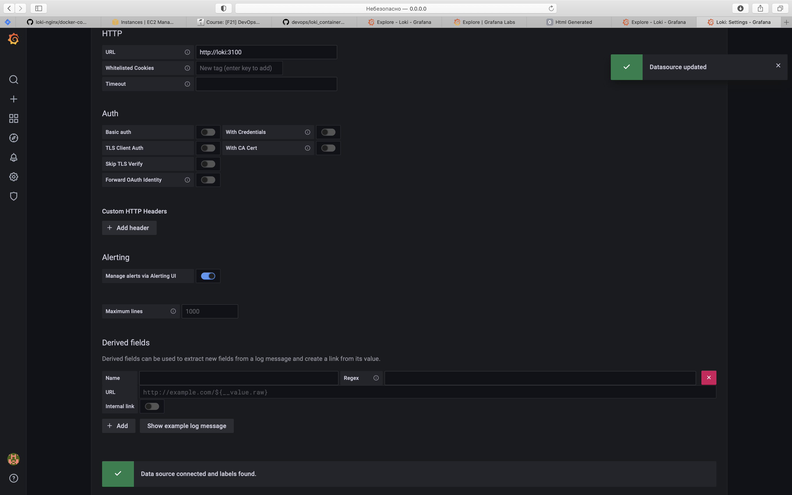
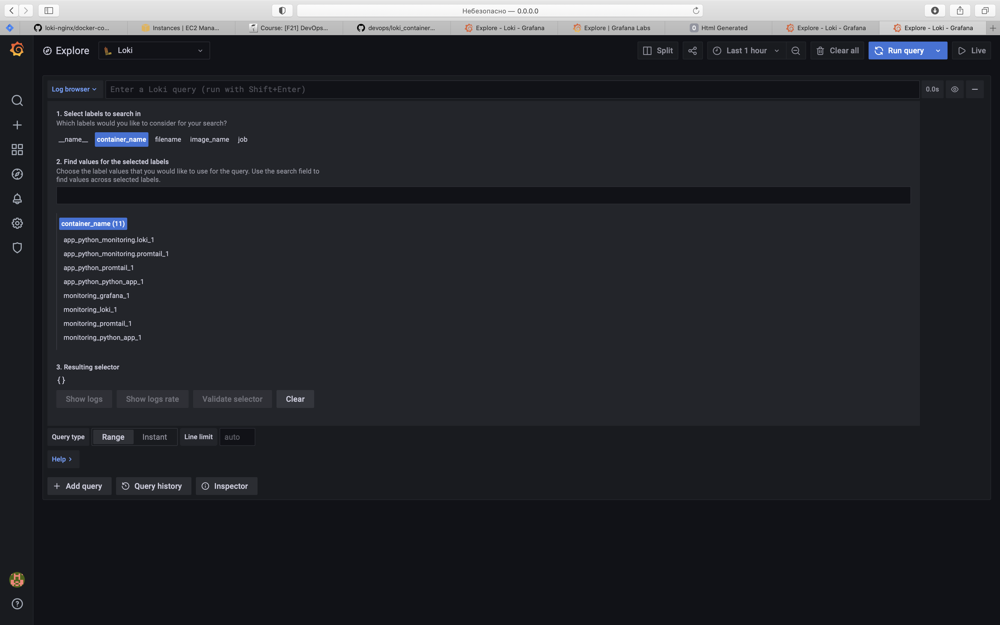
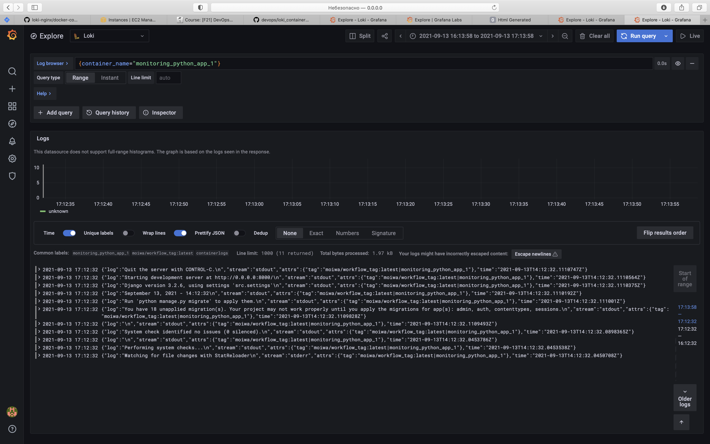

#Best practices with logging
##Done my Mikhail Gudkov
##Original solution
First of all worths mentioning, that originally my solution was based on the
repository from the link attached to the instructions. But this solution had lots of excessive instructions
and configs which we actually don't need. And, honestly, with the most of them I don't want and don't need to go into details.
##Environment variables
I was inspired by the solution of my friend (which by the way also used in original solution) and decided also to have an .env file
with environment variables. Anyway it caused some problems, for example, I was using variable with
the version of grafana, that was used in the original solution, but interface of Grafana > Explore
in this version is not so comfortable as in the latest version.
This of course may cause problems with stability, but I assume that Grafana's docker image is being kept stable by the devs.
##Network
In the original solution they had excessive for our case configurations for network, which I decided to remove.
##Proof of correctness
The next screenshot proves that loki and grafana work properly.

On the next screenshot we can see that local logs from several containers are being passed by promtail correctly.

And the next screenshot proves that logs may really be displayed.

